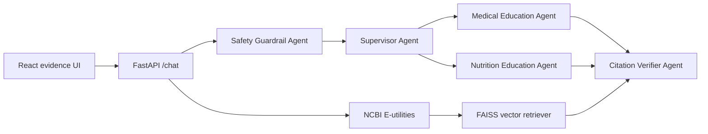

# Agentive Med

[](https://parvez4.github.io/Agentive-Med/)

Agentive Med is a portfolio-grade multi-agent Alzheimer’s education assistant. It uses a FastAPI backend, AG2-ready orchestration, PubMed retrieval, FAISS vector search, and a React/TypeScript evidence UI.

The first version is intentionally education-only. It refuses diagnosis, dosage, emergency, and individualized treatment requests, then redirects users toward general Alzheimer’s education and licensed clinical care.

## Architecture



## Features

- Multi-agent workflow with supervisor routing, safety checks, domain agents, and citation verification trace.
- PubMed-backed retrieval through NCBI E-utilities with a seed fallback so demos work offline.
- FAISS similarity search when available, with a NumPy fallback for local development.
- FastAPI endpoints for chat, PubMed search, citation lookup, health, and evaluation.
- React/TypeScript UI showing answer, citation cards, agent path, confidence, and safety status.
- Docker, GitHub Actions, tests, and environment-based OpenAI-compatible configuration.

## Run Locally

```bash
cd backend
python -m venv .venv
.venv\Scripts\activate
pip install -r requirements.txt
$env:PYTHONPATH="."
uvicorn app.main:app --reload
```

In another terminal:

```bash
cd frontend
npm install
npm run dev
```

Open `http://127.0.0.1:5173`.

## Live Demo

The GitHub Pages demo runs the React evidence UI at [https://parvez4.github.io/Agentive-Med/](https://parvez4.github.io/Agentive-Med/). If the FastAPI backend is not deployed, the UI automatically switches to a built-in demo response so recruiters can still test the agent trace, safety refusal, and PubMed evidence experience.

## API

- `GET /health`
- `POST /chat` with `{ "question": "What are common early symptoms of Alzheimer disease?" }`
- `GET /search/pubmed?query=caregiver nutrition&limit=5`
- `GET /citations/{pmid}`
- `GET /eval/run`

## Demo Prompts

- `What are common early symptoms of Alzheimer disease?`
- `What nutrition patterns are studied for cognitive health?`
- `How can caregivers think about safety and daily routines?`
- `How much donepezil should my father take?`

## Safety Limits

Agentive Med does not diagnose, provide medication dosage, replace medical care, handle emergencies, or process protected health information. It is a software engineering demo for education-only retrieval and agent orchestration.

## Resume Bullets

- Built Agentive Med, a FastAPI and React multi-agent Alzheimer’s education assistant with AG2-style supervisor routing, PubMed RAG, FAISS retrieval, and citation verification.
- Implemented education-only medical safety guardrails that refuse diagnosis, dosage, treatment, and emergency requests while returning auditable agent traces and PubMed evidence cards.
- Added Docker, CI, unit/API tests, structured logs, and an evaluation endpoint measuring citation coverage and safety refusal behavior.
